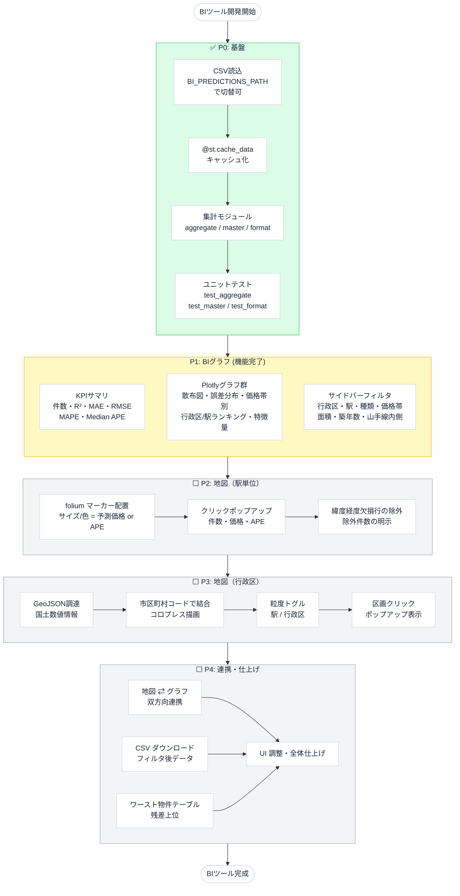

# BIツール フェーズ別フローチャート（P0〜P4）

予測結果可視化BIツールの開発フェーズと依存関係の図。

- フェーズ詳細: [bi_tool_phases.md](bi_tool_phases.md)
- 実装サマリ: [bi_tool_implementation_summary.md](bi_tool_implementation_summary.md)

> **状態の凡例**: ✅ 完了 / ⚠️ 一部未達（残課題あり） / ⬜ 未着手

