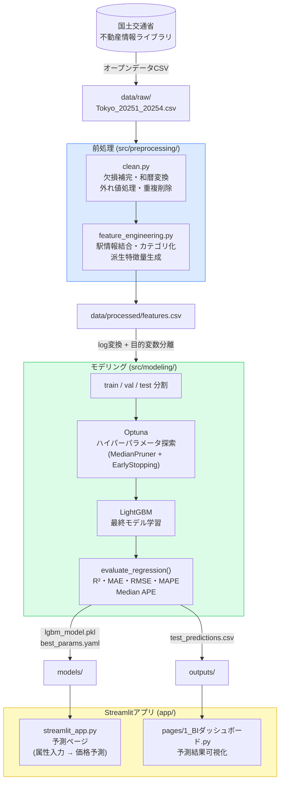

# システム全体パイプライン フローチャート

東京都賃貸物件賃料予測プロジェクトの、データ取得からアプリ表示までの一気通貫フロー。

```mermaid
flowchart TD
    DS[(国土交通省\n不動産情報ライブラリ)] -->|オープンデータCSV| RAW[data/raw/\nTokyo_20251_20254.csv]

    subgraph PREP["前処理 (src/preprocessing/)"]
        direction TB
        CLEAN["clean.py\n欠損補完・和暦変換\n外れ値処理・重複削除"]
        FE["feature_engineering.py\n駅情報結合・カテゴリ化\n派生特徴量生成"]
        CLEAN --> FE
    end

    RAW --> PREP
    FE --> FCSV[data/processed/features.csv]

    subgraph ML["モデリング (src/modeling/)"]
        direction TB
        SPLIT["train / val / test 分割"]
        OPTUNA["Optuna\nハイパーパラメータ探索\n(MedianPruner + EarlyStopping)"]
        TRAIN["LightGBM\n最終モデル学習"]
        EVAL["evaluate_regression()\nR²・MAE・RMSE・MAPE\nMedian APE"]
        SPLIT --> OPTUNA --> TRAIN --> EVAL
    end

    FCSV -->|log変換 + 目的変数分離| ML

    EVAL -->|lgbm_model.pkl\nbest_params.yaml| MDIR[models/]
    EVAL -->|test_predictions.csv| ODIR[outputs/]

    subgraph APP["Streamlitアプリ (app/)"]
        direction LR
        MAIN["streamlit_app.py\n予測ページ\n(属性入力 → 価格予測)"]
        BI["pages/1_BIダッシュボード.py\n予測結果可視化"]
    end

    MDIR --> MAIN
    ODIR --> BI

    style PREP fill:#dbeafe,stroke:#3b82f6
    style ML fill:#dcfce7,stroke:#22c55e
    style APP fill:#fef9c3,stroke:#eab308
```
