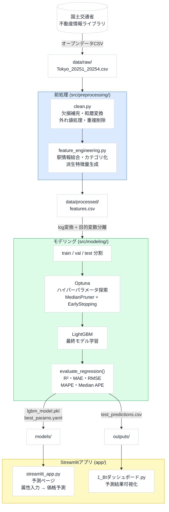

# システム全体パイプライン フローチャート

東京都賃貸物件賃料予測プロジェクトの、データ取得からアプリ表示までの一気通貫フロー。

```mermaid
flowchart TD
    DS[(国土交通省<br/>不動産情報ライブラリ)] -->|オープンデータCSV| RAW["data/raw/<br/>Tokyo_20251_20254.csv"]

    subgraph PREP["前処理 (src/preprocessing/)"]
        direction TB
        CLEAN["clean.py<br/>欠損補完・和暦変換<br/>外れ値処理・重複削除"]
        FE["feature_engineering.py<br/>駅情報結合・カテゴリ化<br/>派生特徴量生成"]
        CLEAN --> FE
    end

    RAW --> PREP
    FE --> FCSV["data/processed/<br/>features.csv"]

    subgraph ML["モデリング (src/modeling/)"]
        direction TB
        SPLIT["train / val / test 分割"]
        OPTUNA["Optuna<br/>ハイパーパラメータ探索<br/>MedianPruner + EarlyStopping"]
        TRAIN["LightGBM<br/>最終モデル学習"]
        EVAL["evaluate_regression()<br/>R²・MAE・RMSE<br/>MAPE・Median APE"]
        SPLIT --> OPTUNA --> TRAIN --> EVAL
    end

    FCSV -->|log変換 + 目的変数分離| ML

    EVAL -->|"lgbm_model.pkl<br/>best_params.yaml"| MDIR[models/]
    EVAL -->|test_predictions.csv| ODIR[outputs/]

    subgraph APP["Streamlitアプリ (app/)"]
        direction LR
        MAIN["streamlit_app.py<br/>予測ページ<br/>属性入力 → 価格予測"]
        BI["1_BIダッシュボード.py<br/>予測結果可視化"]
    end

    MDIR --> MAIN
    ODIR --> BI

    style PREP fill:#dbeafe,stroke:#3b82f6,color:#1f2937
    style ML fill:#dcfce7,stroke:#22c55e,color:#1f2937
    style APP fill:#fef9c3,stroke:#eab308,color:#1f2937

    classDef default fill:#ffffff,color:#1f2937,stroke:#d1d5db
```
